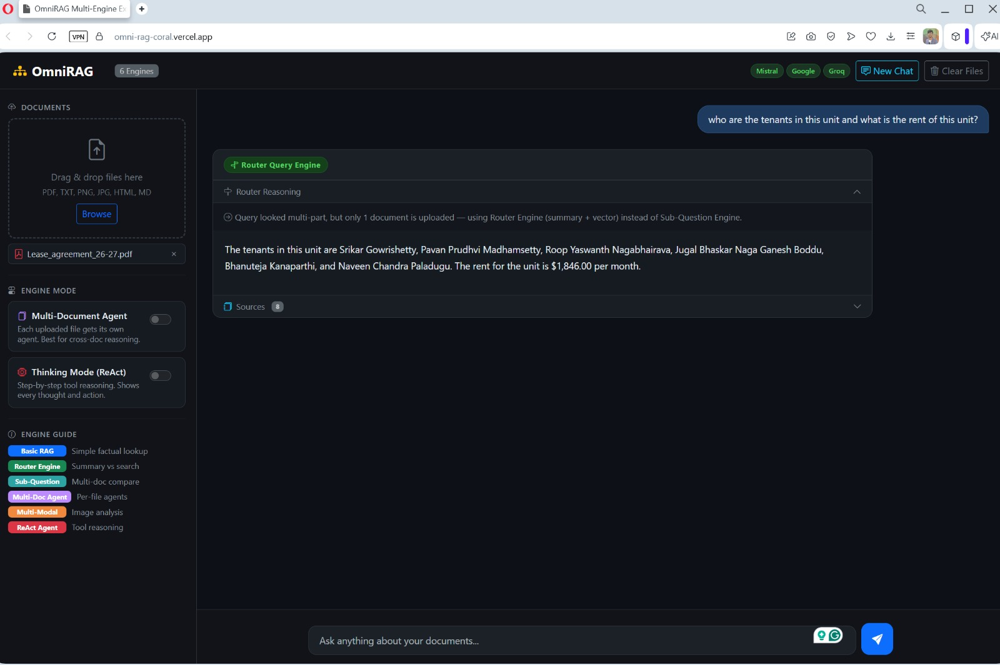

# OmniRAG Multi-Engine Explorer

OmniRAG is a document and image RAG application built with Flask, LlamaIndex, and a static Vercel frontend. The app lets users upload PDFs, text files, markdown, HTML, and images, then routes each question to the best query engine automatically.

The current production architecture is split across two hosts:

- **Backend API:** Hugging Face Spaces, Docker SDK, Flask + Gunicorn on port `7860`.
- **Frontend UI:** Vercel static deployment from `frontend/`.
- **Browser API calls:** the Vercel frontend calls the Hugging Face backend through `OMNIRAG_API_BASE_URL`.

## Demo

The screenshots below show example runs for each OmniRAG engine. Full-size images live in [`demo-images/`](./demo-images/).

| Basic RAG | Router Query |
|---|---|
|  |  |

| Sub-Question Engine | Multi-Document Agent |
|---|---|
|  |  |

| Multi-Modal | ReAct Agent |
|---|---|
|  |  |

## Live Deployment Shape

```text
User browser
  |
  | opens
  v
Vercel static frontend
  - frontend/index.html
  - frontend/static/css/style.css
  - frontend/static/js/main.js
  - frontend/config.js generated at build time
  |
  | HTTPS API calls with X-Omnirag-Session-Id
  v
Hugging Face Docker Space
  - Flask API
  - Gunicorn on PORT=7860
  - uploads stored under UPLOAD_FOLDER
  - indexes stored under CACHE_FOLDER
  |
  | provider API calls
  v
Mistral / Google Gemini-Gemma / Groq / Cohere
```

## Key Features

- **Six RAG engines:** Basic RAG, Router Engine, Sub-Question, Multi-Document Agent, Multi-Modal, and ReAct Agent.
- **Smart routing:** rule-based checks plus Groq fallback choose the best engine for each query.
- **Split frontend/backend deployment:** Vercel serves the UI while Hugging Face runs the heavier Python backend.
- **Cross-domain sessions:** frontend requests send `X-Omnirag-Session-Id`, so uploaded files remain tied to the browser session without relying only on third-party cookies.
- **Persistent paths:** `UPLOAD_FOLDER` and `CACHE_FOLDER` can point to `/data/...` on Hugging Face.
- **OCR fallback:** Docker image includes Tesseract for scanned PDFs.
- **Index caching:** generated vector and summary indexes are cached to reduce repeat work.
- **Provider orchestration:** Mistral, Google, Groq, and optional Cohere are used where each fits best.

## Backend API

The Hugging Face Space serves JSON/API routes:

| Route | Method | Purpose |
|---|---:|---|
| `/` | GET | Backend status JSON |
| `/healthz` | GET | Health check, returns `{"ok": true}` |
| `/api-status` | GET | Shows which provider keys are configured |
| `/upload` | POST | Upload files for the current browser session |
| `/remove-file` | POST | Remove one uploaded file |
| `/clear-files` | POST | Clear uploaded files |
| `/new-chat` | POST | Clear chat history while keeping uploads |
| `/query` | POST | Run router + selected engine |

## Frontend

The Vercel app lives in [`frontend/`](./frontend):

```text
frontend/
  index.html
  package.json
  vercel.json
  build-config.js
  config.js
  static/
    css/style.css
    js/main.js
```

At build time, Vercel runs `npm run build`, which writes `config.js` using:

```env
OMNIRAG_API_BASE_URL=https://username-omnirag.hf.space
```

For this GitHub repo, Vercel's **Root Directory** should be:

```text
frontend
```

Build settings:

```text
Framework Preset: Other
Build Command: npm run build
Output Directory: .
```

## Hugging Face Configuration

Create the Space as:

```text
SDK: Docker
Docker template: Blank
Hardware: CPU Basic
Visibility: Public
```

Required Hugging Face **Secrets**:

```env
MISTRAL_API_KEY=...
GOOGLE_API_KEY=...
GOOGLE_API_KEY_GEMMA=...
GROQ_API_KEY=...
FLASK_SECRET_KEY=...
```

Optional:

```env
COHERE_API_KEY=...
```

Required Hugging Face **Variables**:

```env
PORT=7860
UPLOAD_FOLDER=/data/uploads
CACHE_FOLDER=/data/cache
SESSION_COOKIE_SAMESITE=None
SESSION_COOKIE_SECURE=true
CORS_ORIGINS=https://omni-rag-coral.vercel.app,http://localhost:3000
```

Use the Vercel production domain in `CORS_ORIGINS`. Include `http://localhost:3000` only for local frontend testing.

## Vercel Configuration

Required Vercel environment variable:

```env
OMNIRAG_API_BASE_URL=https://username-omnirag.hf.space
```

Use the `.hf.space` URL, not the Hugging Face repository URL.

Correct:

```text
https://username-omnirag.hf.space
```

Incorrect:

```text
https://huggingface.co/spaces/username/OmniRAG
```

## Engines

| Engine | Main provider | Model | Best for |
|---|---|---|---|
| Basic RAG | Mistral | `mistral-large-latest` | Simple factual lookups |
| Router Engine | Google | `gemma-4-31b-it` | Summary vs vector search routing |
| Sub-Question | Google | `gemma-4-31b-it` | Decomposed multi-part questions |
| Multi-Doc Agent | Google + Groq | Gemma + Llama 4 Scout | Cross-document reasoning |
| Multi-Modal | Groq | Llama 4 Scout vision | Image analysis |
| ReAct Agent | Google | `gemini-2.5-flash` | Step-by-step tool reasoning |

Supporting services:

| Service | Provider | Purpose |
|---|---|---|
| Query routing | Groq | Classify ambiguous queries |
| Text embeddings | Hugging Face | Basic RAG and ReAct embeddings |
| Multi-doc embeddings | Mistral | Multi-document and sub-question indexes |
| Follow-up rewrite | Groq | Convert follow-up questions into standalone questions |
| Reranking | Cohere, optional | Improve multi-document retrieval ranking |

## Local Backend Run

```bash
pip install -r requirements.txt
cp .env.example .env
python app.py
```

The local Flask backend runs at:

```text
http://127.0.0.1:5000
```

## Local Frontend Run

Because the frontend is static, you can serve `frontend/` with any static server. Set `frontend/config.js` manually for local testing:

```js
window.OMNIRAG_API_BASE_URL = "http://127.0.0.1:5000";
```

Then serve the folder:

```bash
cd frontend
python -m http.server 3000
```

Open:

```text
http://localhost:3000
```

## Project Structure

```text
app/
  app.py                 Flask API routes
  config.py              environment-driven app configuration
  Dockerfile             Hugging Face Docker Space image
  DEPLOYMENT.md          detailed HF + Vercel deployment notes
  requirements.txt       Python dependencies
  router.py              smart query routing
  doc_loader.py          document loading and OCR fallback
  index_cache.py         persisted index cache helpers
  model_cache.py         embedding model singleton cache
  engines/               RAG and agent engines
  frontend/              Vercel static frontend
  demo-images/           screenshots for README examples
  static/                legacy/shared UI assets
  templates/             legacy Flask template assets
  uploads/               local uploads, ignored by git
  cache/                 local index cache, ignored by git
```

## Troubleshooting

### Vercel shows 404

Check that:

- `frontend/index.html` is present in GitHub.
- Vercel Root Directory is `frontend`.
- Output Directory is `.`.
- The latest GitHub commit has been redeployed.

### API status is blank in the frontend

Check that:

- `OMNIRAG_API_BASE_URL` in Vercel points to the `.hf.space` URL.
- Hugging Face `CORS_ORIGINS` includes the exact Vercel domain with `https://`.
- The Hugging Face Space was restarted after changing variables.

### Hugging Face shows 500 on `/`

The backend root route should return JSON. If it tries to render `templates/index.html`, deploy the latest backend code.

### First query is slow

The first query may download the Hugging Face embedding model and build indexes. Later queries reuse cached models and indexes.

## Companion Notebooks

The engines are based on the notebook examples in the parent LlamaIndex cookbook folder:

| Notebook | Engine |
|---|---|
| `Basic_RAG_With_LlamaIndex.ipynb` | Basic RAG |
| `Router_Query_Engine.ipynb` | Router Engine |
| `SubQuestion_Query_Engine.ipynb` | Sub-Question |
| `Multi_Document_Agents.ipynb` | Multi-Document Agent |
| `Multi_Modal.ipynb` | Multi-Modal |
| `ReAct_Agent.ipynb` | ReAct Agent |

## License

MIT. This project is part of the cookbook work around LlamaIndex RAG patterns.
